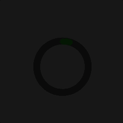
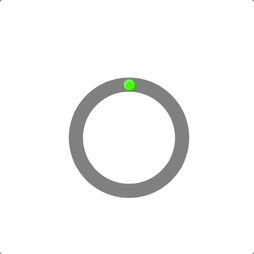

<div align="center">
  <h1><strong>CircularProgressView</strong></h1>
</div>

## Owerview
**CircularProgressView** is a lightweight and easy-to-use UI element for displaying progress in your application. It allows you to visualize task progress with minimal resource consumption, supporting both filling animations to a specific value and loading animations. Designed for projects where performance and ease of integration are important.

## Element appearance
<div align="center">
    
</div>

## Why does it exist?
After not finding a comprehensive example of such a UI element online, it was decided to create it myself. Additionally, I was prompted by a request from a colleague to implement it for a project.  
**Therefore, this code exists—feel free to use it!**

## Usage
1. Add the `CircularProgressView.swift` file to your project in Xcode.
2. Place the `CircularProgressView` on your `ViewController` in one of the following ways, for example:
```swift 
let circularProgressView = CircularProgressView()
view.addSubview(circularProgressView)
circularProgressView.translatesAutoresizingMaskIntoConstraints = false

NSLayoutConstraint.activate([
	circularProgressView.centerXAnchor.constraint(equalTo: view.centerXAnchor),
	circularProgressView.centerYAnchor.constraint(equalTo: view.centerYAnchor),
	circularProgressView.widthAnchor.constraint(equalToConstant: 300), 
	circularProgressView.heightAnchor.constraint(equalToConstant: 300)
])
```
Or in a simpler way:
```swift
let circularProgressView = CircularProgressView(frame: CGRect(x: 0, y: 0, width: 300, height: 300))
circularProgressView.center = view.center
```
3. If needed, specify the colors for the progress circle and the background circle:
```swift
circularProgressView.colorBackCircle = .red // Default is gray 

circularProgressView.colorProgressCircle = .blue // Default is green
```
4. Done! You can start using the UI element.
5. To display a specific value, use the `setValue` method:
```swift
circularProgressView.setValue(value: 0.5, animated: true, timeInterval: 1.5)
// value ranges from 0.0 to 1.0
// Default arguments are animated: true, timeInterval: 1.0
```
6. To display a loading animation, use the `startLoadingAnimation` method. The `duration` argument controls the animation speed:
```swift
// Default argument is 2.0
circularProgressView.startLoadingAnimation()

// Reducing the argument value speeds up the loading animation
circularProgressView.startLoadingAnimation(duration: 1.0)
```
7. To stop the animation, use the `stopLoadingAnimation` method. It has no arguments and simply stops the animation.


<div align="center">
  <h1><strong>Good luсk!</strong></h1>
</div>
